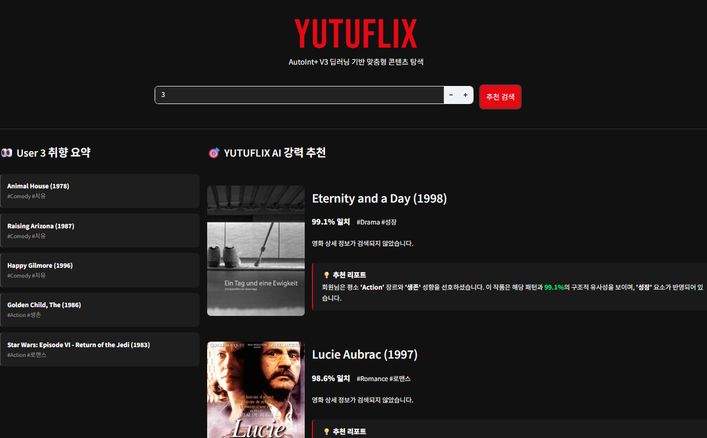

# 📺 YUTUFLIX : AutoInt+ V3 기반 추천 서비스 고도화 프로젝트



## 1. 프로젝트 개요
이번 프로젝트는 무비렌즈(MovieLens) 데이터를 활용해 유저의 클릭 확률을 예측하는 딥러닝 모델을 구축하고, 이를 실제 서비스 형태인 **'YUTUFLIX(유튜플릭스)'**로 배포하는 것을 목표로 했습니다. 단순히 돌아가는 코드를 만드는 것을 넘DJ **"프레임워크 변환과 "실험 중심의 데이터 전처리"**를 중점적으로 다뤘습니다.
```text
YUTUFLIX-Recommendation/
├── data/                                 
│   ├── movielens_rcmm_v2.csv             # 평점 4점 이상 선호 기반 데이터셋
│   └── movies_narrative_v3_full.csv      # 서사 키워드가 포함된 영화 메타데이터
├── images/                               
│   └── YOUTUFLEX.png                     # 서비스 시연 스크린샷
├── autoint_mlp_v3_train.ipynb            # 데이터 분석 및 모델 학습 과정 (V3)
├── autointmlp_v3.py                      # TF로 변환한 AutoInt+ V3 아키텍처 클래스
├── show_st_plus.py                       # TMDB API 연동 및 스트림릿 서비스 코드
├── requirements.txt                      # 필수 패키지 (requests 포함)
├── .gitattributes                        # Git LFS 설정
└── README.md                             # 프로젝트 회고
---

## 2. 핵심 시도 및 성과

### PyTorch 모델의 TensorFlow 재구현 (어려운 난이도 도전)
* PyTorch 기반의 AutoInt+ 코드를 분석하여 TensorFlow 2.x 환경으로 재구성했습니다. 
* **해결**: 레이어 이름 충돌 및 데이터 타입(longlong 등) 에러를 하나하나 디버깅하며 모델을 패킹했고 그 결과 로컬 환경에서도 안정적인 추론이 가능해졌습니다.

### 실험적 데이터 라벨링 (V1 vs V2)
* **기존 방식 (V1)**: 랜덤 샘플링 기반
* **개선 방식 (V2)**: "유저가 4점 이상 준 영화는 확실한 선호일 것"이라는 가정을 세워 4점 이상은 1(Positive), 3점 이하는 0(Negative)으로 라벨링하여 학습 효율을 극대화했습니다.
* **결과**: 테스트 셋 기준 **AUC 0.8064**라는 안정적인 성능을 확보했습니다.

### 피처 엔지니어링: Narrative Keyword 추가
* 영화의 기본 장르 정보 외에도 영화가 가진 고유의 분위기나 결을 설명하는 `narrative_keyword`(서사 키워드)를 필드로 추가하여, 모델이 유저의 감성적 취향까지 포착할 수 있도록 개선했습니다.

---

## 3. 서비스화 (UX/UI 전략)

유저들이 추천을 받았을 때 설득력을 느낄 수 있도록 UI를 설계했습니다.

* **실시간 TMDB API 연동**: 텍스트 데이터만으로는 부족한 시각적 정보를 보충하기 위해 TMDB API를 통해 영화 포스터와 한국어 줄거리를 실시간으로 노출했습니다.
* **AI 추천 리포트**: 단순히 영화 목록만 띄우지 않고, 해당 유저가 과거에 좋아했던 장르와 키워드를 대조하여 "당신이 좋아한 #성장 #드라마 코드와 XX% 일치합니다"라는 개인화된 추천 근거를 제공합니다.
* **레이아웃**: 구글 검색의 직관성과 넷플릭스의 다크 테마를 결합하여 전문성을 높였습니다.

---

## 4. 최종 회고 (Retrospective)

처음에는 더 큰 모델을 붙여 성능 수치만 올리려 했으나 적절한 데이터 정제와 구조 설계의 더욱 중요함을 깨달았습니다.

### 트러블슈팅의 기록
로컬 환경과 학습 환경의 버전 차이로 인해 가중치를 로드할 때 레이어 이름이 어긋나는 문제가 있었으나, 모델 객체를 빌드한 후 가중치를 로드하는 안정적인 방식을 도입해 해결했습니다.

### 결론
이번 프로젝트를 통해 추천 시스템의 전 과정을 경험하며, 데이터 사이언티스트는 모델 성능 지표(AUC)만큼이나 **'유저의 경험과 설득력'**을 고민해야 한다는 것을 배웠습니다.  
